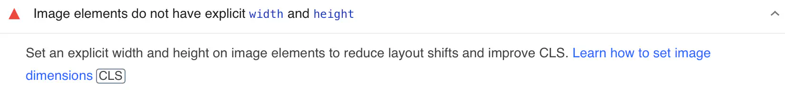

# mdbook-tailor

This is a preprocessor for [mdbook](https://github.com/rust-lang/mdBook).

We plan to take some more time before a major release 🐣

_🔺It includes some issues as noted in [Issues](https://github.com/CoralPink/mdbook-tailor/issues)._

## Purpose

The following warnings in [PageSpeed Insights](https://pagespeed.web.dev) can be eliminated by using this preprocessor.



Explicitly setting the width and height of image elements will reduce layout deviations and improve CLS.

## Corresponding image file

The image files that this project can handle depend on Imaging library.

[An Image Processing Library](https://crates.io/crates/image)

It supports `PNG`, `JPEG`, `GIF`, `WebP`, `AVIF` etc. as generally used in web pages 😉

## Installation

1. Use `cargo` to install.

```sh
cargo install mdbook-tailor
```

2. Add the following to `book.toml`.

```toml
[preprocessor.tailor]
```

## Usage

1. Use markdown notation as usual.

```markdown

```

2. Do the mdbook build as usual. 

```sh
mdbook build
```

The `HTML` generated from the above steps should contain the image size as measured by the `mdbook-tailor`.
In addition, a delayed loading setting will be added!

```html

```

## Precautions

Images in markdown tables are not detected.

Ex)

```markdown
|Header Left|Header Right|
|:---:|:---:|
|||
```

Naturally I would like to be able to detect and process this as well, but I must admit I am out of my depth...❗😿

## Example

This is actually a site I am producing myself ☺️

 * GitHub Pages
   https://coralpink.github.io/commentary
 * GitHub
   https://github.com/CoralPink/commentary

## License

Licensed under either of

 * Apache License, Version 2.0
   ([LICENSE-APACHE](LICENSE-APACHE) or http://www.apache.org/licenses/LICENSE-2.0)
 * MIT license
   ([LICENSE-MIT](LICENSE-MIT) or http://opensource.org/licenses/MIT)

at your option.

## Contribution

Unless you explicitly state otherwise, any contribution intentionally submitted
for inclusion in the work by you, as defined in the Apache-2.0 license, shall be
dual licensed as above, without any additional terms or conditions.
